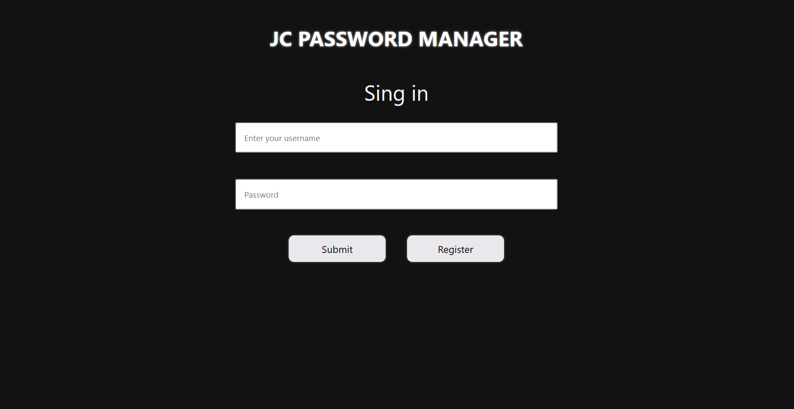
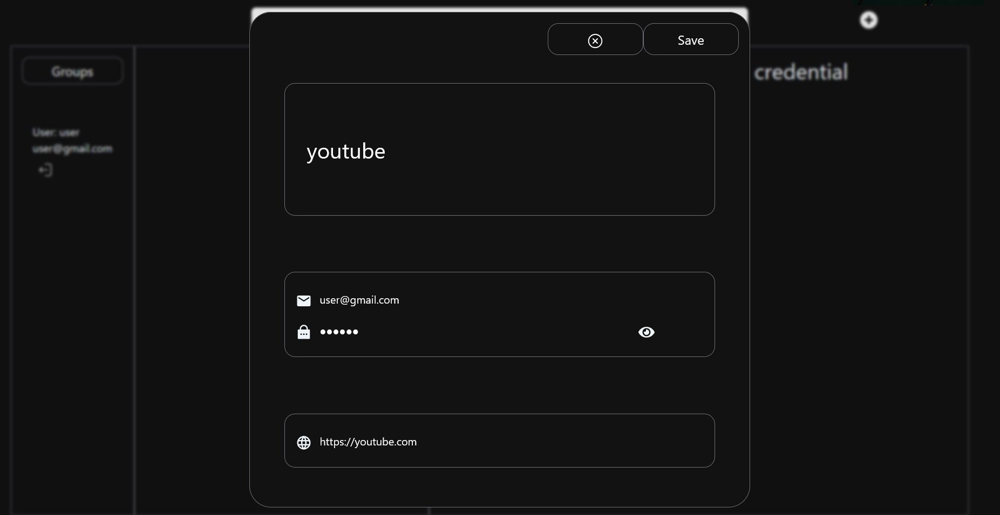
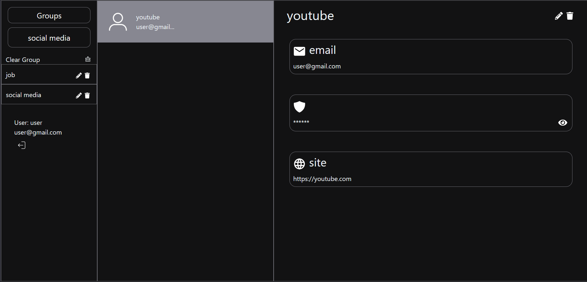
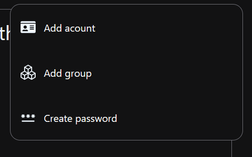

# JC Password Manager 🔐

**JC Password Manager** es una aplicación web full-stack diseñada para la gestión segura de credenciales y contraseñas. Proporciona un sistema robusto de autenticación, organización por grupos y almacenamiento cifrado de información sensible.

## Tabla de Contenidos

- [Tecnologías](#tecnologías)
- [Arquitectura](#arquitectura)
- [Requisitos Previos](#requisitos-previos)
- [Instalación y Configuración](#instalación-y-configuración)
- [Variables de Entorno](#variables-de-entorno)
- [Ejecución del Proyecto](#ejecución-del-proyecto)
- [Funcionalidades](#funcionalidades)
- [Estructura del Proyecto](#estructura-del-proyecto)
- [API Endpoints](#api-endpoints)

## Tecnologías

### Backend
* **Framework:** Spring Boot 3.4.3
* **Lenguaje:** Java 21
* **Base de Datos:** PostgreSQL
* **Seguridad:** Spring Security + JWT (JSON Web Tokens)
* **ORM:** Spring Data JPA / Hibernate
* **Build Tool:** Maven
* **Dependencias Clave:**
  - `jjwt` (0.11.5) - Manejo de tokens JWT
  - `Lombok` (1.18.36) - Reducción de código boilerplate
  - `dotenv-java` (2.2.4) - Gestión de variables de entorno

### Frontend
* **Framework:** React 18.3.1 + TypeScript
* **Build Tool:** Vite 6.0.5
* **State Management:** Redux Toolkit 2.5.1
* **UI Framework:** React Bootstrap 5.3.3
* **Routing:** React Router 7.1.3
* **Iconos:** React Icons 5.4.0
* **Autenticación:** jwt-decode 4.0.0

## Arquitectura

El proyecto sigue una arquitectura **cliente-servidor** con separación clara entre frontend y backend:

```
jcpasswordManagger/
├── jcpm-backend/          # API REST con Spring Boot
│   ├── src/
│   │   └── main/
│   │       ├── java/com/jcPasswordMannager/jcpm_backend/
│   │       │   ├── auth/           # Autenticación y autorización
│   │       │   ├── credential/     # Gestión de credenciales
│   │       │   ├── group/          # Organización por grupos
│   │       │   ├── user/           # Gestión de usuarios
│   │       │   ├── jwt/            # Servicios JWT
│   │       │   └── config/         # Configuración de seguridad
│   │       └── resources/
│   │           └── application.properties
│   └── pom.xml
│
├── jcpm-frontend/         # SPA con React + TypeScript
│   ├── src/
│   │   ├── UI/                # Componentes de interfaz
│   │   ├── router/            # Configuración de rutas
│   │   └── main.tsx
│   └── package.json
│
└── [Imágenes de documentación]
```

### Patrón de Diseño

**Backend:**
- **Arquitectura en capas:** Controller → Service → Repository
- **DTOs (Data Transfer Objects)** para separar la capa de presentación del modelo de datos
- **Mappers** para conversión entre entidades y DTOs
- **JWT Filter** para interceptar y validar tokens en cada request

**Frontend:**
- **Component-Based Architecture** con React
- **Redux Store** para estado global de la aplicación
- **Protected Routes** para rutas que requieren autenticación

## Requisitos Previos

Antes de comenzar, asegúrate de tener instalado:

### Backend
- **Java Development Kit (JDK) 21** o superior
  - [Descargar OpenJDK](https://adoptium.net/)
  - Verificar instalación: `java -version`
- **Maven 3.6+** (incluido en el wrapper del proyecto)
  - Verificar instalación: `mvn -version`
- **PostgreSQL 12+**
  - [Descargar PostgreSQL](https://www.postgresql.org/download/)
  - Verificar instalación: `psql --version`

### Frontend
- **Node.js 18+** y **npm** o **yarn**
  - [Descargar Node.js](https://nodejs.org/)
  - Verificar instalación: `node -v` y `npm -v`

## Instalación y Configuración

### 1. Clonar el Repositorio

```bash
git clone <URL_DEL_REPOSITORIO>
cd jcpasswordManagger
```

### 2. Configurar la Base de Datos

#### Crear la base de datos PostgreSQL:

```sql
-- Conectarse a PostgreSQL
psql -U postgres

-- Crear la base de datos
CREATE DATABASE jcpm_db;

-- Crear usuario (opcional, si no usas el usuario postgres por defecto)
CREATE USER jcpm_user WITH PASSWORD 'tu_password_seguro';

-- Otorgar permisos
GRANT ALL PRIVILEGES ON DATABASE jcpm_db TO jcpm_user;

-- Salir
\q
```

### 3. Configurar el Backend

#### Navegar a la carpeta del backend:
```bash
cd jcpm-backend
```

#### Crear archivo `.env` en la raíz de `jcpm-backend/`:

```env
# Database Configuration
DB_URL=jdbc:postgresql://localhost:5432/jcpm_db
DB_USERNAME=postgres
DB_PASSWORD=tu_password_de_postgresql

# JWT Configuration
JWT_SECRET=tu_clave_secreta_muy_larga_y_segura_minimo_256_bits
JWT_EXPIRATION=86400000

# Server Configuration
SERVER_PORT=8081
```

> **Nota:** También puedes modificar directamente el archivo `src/main/resources/application.properties`

#### Instalar dependencias y compilar:

```bash
# En Windows
.\mvnw clean install

# En Linux/Mac
./mvnw clean install
```

### 4. Configurar el Frontend

#### Navegar a la carpeta del frontend:
```bash
cd ../jcpm-frontend
```

#### Crear archivo `.env` en la raíz de `jcpm-frontend/`:

```env
VITE_API_URL=http://localhost:8081/api
```

#### Instalar dependencias:

```bash
# Con npm
npm install

# O con yarn
yarn install
```

## Variables de Entorno

### Backend (`jcpm-backend/.env`)

| Variable | Descripción | Ejemplo |
|----------|-------------|---------|
| `DB_URL` | URL de conexión a PostgreSQL | `jdbc:postgresql://localhost:5432/jcpm_db` |
| `DB_USERNAME` | Usuario de la base de datos | `postgres` |
| `DB_PASSWORD` | Contraseña de la base de datos | `tu_password` |
| `JWT_SECRET` | Clave secreta para firmar tokens JWT | `clave_secreta_256_bits` |
| `JWT_EXPIRATION` | Tiempo de expiración del token (ms) | `86400000` (24 horas) |
| `SERVER_PORT` | Puerto del servidor backend | `8081` |

### Frontend (`jcpm-frontend/.env`)

| Variable | Descripción | Ejemplo |
|----------|-------------|---------|
| `VITE_API_URL` | URL base de la API backend | `http://localhost:8081/api` |

## Ejecución del Proyecto

### Iniciar el Backend

```bash
cd jcpm-backend

# Con Maven Wrapper (recomendado)
# Windows
.\mvnw spring-boot:run

# Linux/Mac
./mvnw spring-boot:run

# O con Maven instalado globalmente
mvn spring-boot:run
```

El backend estará disponible en: **http://localhost:8081**

### Iniciar el Frontend

```bash
cd jcpm-frontend

# Con npm
npm run dev

# O con yarn
yarn dev
```

El frontend estará disponible en: **http://localhost:5173** (puerto por defecto de Vite)

## Funcionalidades

### 1. Sistema de Autenticación

Acceso seguro mediante JWT con registro e inicio de sesión.

* **Login Seguro:** Autenticación con email y contraseña
* **Registro de Usuarios:** Creación de nuevas cuentas
* **Tokens JWT:** Sesiones seguras sin estado en el servidor
* **Protección de Rutas:** Acceso restringido a usuarios autenticados



### 2. Gestión de Credenciales

Almacenamiento y organización de contraseñas y credenciales.

* **Crear Credenciales:** Formulario intuitivo para agregar nuevas credenciales
* **Campos Personalizables:**
  - Nombre del servicio
  - URL del sitio web
  - Usuario/Email
  - Contraseña
  - Notas adicionales
* **Organización por Grupos:** Categorización de credenciales
* **Búsqueda y Filtrado:** Localización rápida de credenciales



### 3. Visualización de Credenciales

Interfaz clara para consultar información almacenada.

* **Vista Detallada:** Visualización completa de cada credencial
* **Mostrar/Ocultar Contraseña:** Toggle de visibilidad para seguridad
* **Copiar al Portapapeles:** Copia rápida de usuario y contraseña
* **Información Completa:** Todos los campos en una vista organizada



### 4. Menú de Acciones

Operaciones rápidas sobre credenciales.

* **Editar:** Modificar información existente
* **Eliminar:** Borrado seguro de credenciales
* **Compartir:** (Funcionalidad futura)
* **Exportar:** (Funcionalidad futura)



## Estructura del Proyecto

### Backend - Módulos Principales

```
jcpm-backend/src/main/java/com/jcPasswordMannager/jcpm_backend/
│
├── auth/                           # Módulo de Autenticación
│   ├── AuthController.java        # Endpoints de login/register
│   ├── AuthService.java           # Lógica de autenticación
│   ├── LoginRequest.java          # DTO para login
│   ├── RegisterRequest.java       # DTO para registro
│   └── AuthResponse.java          # DTO de respuesta con token
│
├── credential/                     # Módulo de Credenciales
│   ├── CredentialController.java  # CRUD de credenciales
│   ├── CredentialService.java     # Lógica de negocio
│   ├── CredentialRepository.java  # Acceso a datos
│   ├── CredentialModel.java       # Entidad JPA
│   ├── CredentialCreateDTO.java   # DTO de creación
│   └── CredentialMapper.java      # Conversión Entity ↔ DTO
│
├── group/                          # Módulo de Grupos
│   ├── GroupController.java       # CRUD de grupos
│   ├── GroupService.java          # Lógica de negocio
│   ├── GroupRepository.java       # Acceso a datos
│   ├── GroupModel.java            # Entidad JPA
│   ├── GroupCreateDTO.java        # DTO de creación
│   └── GroupMapper.java           # Conversión Entity ↔ DTO
│
├── user/                           # Módulo de Usuarios
│   ├── UserController.java        # Endpoints de usuario
│   ├── UserService.java           # Lógica de negocio
│   ├── UserRepository.java        # Acceso a datos
│   ├── UserModel.java             # Entidad JPA (UserDetails)
│   ├── UserDTO.java               # DTO de usuario
│   └── UserDTOMapper.java         # Conversión Entity ↔ DTO
│
├── jwt/                            # Módulo JWT
│   ├── JwtService.java            # Generación y validación de tokens
│   └── JwtAuthenticationFilter.java # Filtro de autenticación
│
└── config/                         # Configuración
    ├── SecurityFilter.java        # Configuración de Spring Security
    └── ApplicationConfig.java     # Beans de configuración
```

### Frontend - Componentes Principales

```
jcpm-frontend/src/
│
├── UI/                             # Componentes de Interfaz
│   ├── navbar/
│   │   └── NavBar.tsx             # Barra de navegación
│   ├── side-bar-log-out/
│   │   └── SideBarLogOut.tsx      # Sidebar con logout
│   ├── session-menu/
│   │   └── SessionMenu.tsx        # Menú de sesión
│   ├── add-menu/
│   │   └── AddMenu.tsx            # Menú para agregar items
│   └── title/
│       └── Title.tsx              # Componente de título
│
├── router/
│   └── AppRouter.tsx              # Configuración de rutas
│
├── JcPasswordMannagerApp.tsx      # Componente raíz
└── main.tsx                       # Punto de entrada
```

## 🔌 API Endpoints

### Autenticación

| Método | Endpoint | Descripción | Body |
|--------|----------|-------------|------|
| POST | `/api/auth/register` | Registrar nuevo usuario | `{ email, password, name }` |
| POST | `/api/auth/login` | Iniciar sesión | `{ email, password }` |

**Respuesta exitosa:**
```json
{
  "token": "eyJhbGciOiJIUzI1NiIsInR5cCI6IkpXVCJ9...",
  "user": {
    "id": 1,
    "email": "user@example.com",
    "name": "Usuario"
  }
}
```

### Credenciales

| Método | Endpoint | Descripción | Requiere Auth |
|--------|----------|-------------|---------------|
| GET | `/api/credentials` | Obtener todas las credenciales del usuario | ✅ |
| GET | `/api/credentials/{id}` | Obtener credencial por ID | ✅ |
| POST | `/api/credentials` | Crear nueva credencial | ✅ |
| PUT | `/api/credentials/{id}` | Actualizar credencial | ✅ |
| DELETE | `/api/credentials/{id}` | Eliminar credencial | ✅ |

**Ejemplo de creación:**
```json
{
  "serviceName": "GitHub",
  "url": "https://github.com",
  "username": "usuario@email.com",
  "password": "contraseña_segura",
  "notes": "Cuenta personal",
  "groupId": 1
}
```

### Grupos

| Método | Endpoint | Descripción | Requiere Auth |
|--------|----------|-------------|---------------|
| GET | `/api/groups` | Obtener todos los grupos del usuario | ✅ |
| GET | `/api/groups/{id}` | Obtener grupo por ID | ✅ |
| POST | `/api/groups` | Crear nuevo grupo | ✅ |
| PUT | `/api/groups/{id}` | Actualizar grupo | ✅ |
| DELETE | `/api/groups/{id}` | Eliminar grupo | ✅ |

### Usuarios

| Método | Endpoint | Descripción | Requiere Auth |
|--------|----------|-------------|---------------|
| GET | `/api/users/me` | Obtener información del usuario actual | ✅ |
| PUT | `/api/users/me` | Actualizar información del usuario | ✅ |

## Seguridad

### Características de Seguridad Implementadas

1. **Autenticación JWT:**
   - Tokens firmados con algoritmo HS256
   - Expiración configurable (por defecto 24 horas)
   - Validación en cada request protegido

2. **Spring Security:**
   - Filtros de autenticación personalizados
   - Endpoints públicos: `/api/auth/**`
   - Endpoints protegidos: Todos los demás

3. **Cifrado de Contraseñas:**
   - BCrypt para hash de contraseñas de usuarios
   - Almacenamiento seguro en base de datos

4. **CORS Configuration:**
   - Configurado para desarrollo local
   - Debe ajustarse para producción

### Recomendaciones para Producción

- [ ] Cambiar `JWT_SECRET` por una clave de 256 bits generada aleatoriamente
- [ ] Configurar HTTPS en el servidor
- [ ] Implementar rate limiting para prevenir ataques de fuerza bruta
- [ ] Cifrar credenciales almacenadas en la base de datos
- [ ] Configurar CORS para dominios específicos
- [ ] Implementar refresh tokens para sesiones largas
- [ ] Agregar logging y monitoreo de seguridad

## Testing

### Backend
```bash
cd jcpm-backend
./mvnw test
```

### Frontend
```bash
cd jcpm-frontend
npm run test
```

## Notas de Desarrollo

### Configuración de Base de Datos

El proyecto usa `spring.jpa.hibernate.ddl-auto=update`, lo que significa que Hibernate creará y actualizará automáticamente las tablas según las entidades definidas. Para producción, se recomienda usar migraciones con Flyway o Liquibase.

### Hot Reload

- **Backend:** Spring Boot DevTools habilitado para recarga automática
- **Frontend:** Vite proporciona HMR (Hot Module Replacement) automático

### Puertos por Defecto

- Backend: `8081`
- Frontend: `5173`
- PostgreSQL: `5432`

## Contribuciones

Este es un proyecto personal de **Juan Cruz**. Si deseas contribuir o reportar issues, contacta al desarrollador.

## Licencia

Este proyecto es de código abierto.
